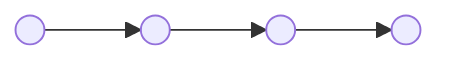
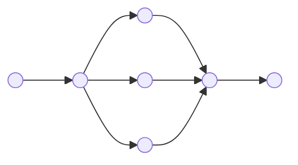
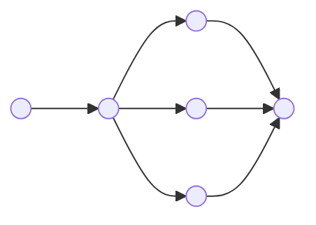

## Overview
Chains allow us to combine multiple components (LLMs, Prompts, Tools) into a single, coherent application. They are the fundamental building blocks of LangChain workflows.

There are 3 types of Chains in LangChain
## 1. Sequential Chains
**Concept:** The output of one step serves as the input for the next. This is a deterministic, linear workflow.



Code
> [!NOTE] Example
> In this example we are going to enter a paragraph in English, then translate it into Hindi and then summarize and give the output

```python
from langchain_core.prompts import PromptTemplate
from langchain_core.output_parsers import StrOutputParser
```

```python
prompt1 = PromptTemplate(
  template="Translate this English paragraph into Hindi. Paragraph:{paragraph}",
  input_variables=['paragraph']
)  

prompt2 = PromptTemplate(
  template="Summarise this Hindi paragraph. Paragraph:{paragraph}",
  input_variables=['paragraph']
) 

parser = StrOutputParser()
```

```python
chain1 = prompt1 | model | parser
chain2 = prompt2 | model | parser
```

```python
paragraph_input = """Tirupati is revered as the spiritual heart of Andhra Pradesh, celebrated for the sacred Tirumala Venkateswara Temple atop the seven hills of Tirumala. For centuries, millions of devotees have journeyed here to seek blessings from Lord Venkateswara, making it one of the most visited pilgrimage sites in the world. The city’s heritage is deeply rooted in rituals, traditions, and devotional music that echo through its temples, symbolizing faith and continuity of Hindu spiritual practice. Beyond the temple, Tirupati embodies a living legacy of devotion, where spirituality blends seamlessly with culture and community life.
"""
```

```python
finalChain = chain1 | chain2 # (or) 
# finalChain = prompt1|model|parser|prompt2|model|parser
result = finalChain.invoke({'paragraph':paragraph_input})
print(result)
```
We get a Hindi Summary of the English Paragraph

```python
# You can view the complete flow of your chains in a graphical format
print(finalChain.get_graph().print_ascii())
```

---
## 2. Parallel Chains

**Concept:** The input is passed to multiple chains simultaneously. The results are then aggregated or passed to a final step.



> [!Example] 
> In this example we are going to give an English news paragraph and then translate it into Telugu and then summarize it into a one Liner Telugu click bate

```python
prompt1 = PromptTemplate(
  template="Translate this English paragraph into Telugu. Paragraph:{paragraph}",
  input_variables=['paragraph']
)

prompt2 = PromptTemplate(
  template="Create Hashtags based on this paragraph. Paragraph:{paragraph}",
  input_variables=['paragraph']
)

prompt3 = PromptTemplate(
  template="Use this paragraph: {paragraph} and a set of hashtags: {hashtags} and create a crisp Telugu one liner which can be sent to users as notifications as a clickBate",

  input_variables=['paragraph','hashtags']
) 

parser = StrOutputParser()
```

```python
from langchain_core.runnables import RunnableParallel
```

```python
parallel_chain = RunnableParallel(
  {
      'paragraph':prompt1 | model | parser,
      'hashtags':prompt2 | model | parser
  }
)
```

```python
sequential_chain = prompt3 | model | parser
final_chain = parallel_chain | sequential_chain
```

```python
paragraph_input = """Recently, IndiGo faced widespread flight cancellations due to operational disruptions, including crew shortages and technical scheduling challenges. Passengers across major Indian cities experienced delays and cancellations, prompting the airline to issue apologies and assurances of corrective measures. The incident highlights the growing strain on aviation operations during peak travel seasons, raising concerns about reliability and passenger convenience."""
```

```python
result = final_chain.invoke({'paragraph':paragraph_input})
print(result)
```

---
## 3. Conditional / (Router) Chains 
**Concept:** The input is analyzed to determine _which_ chain should process it. It acts like an `if/else` statement or a switch case.


