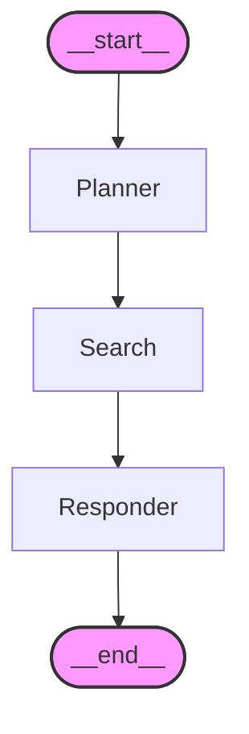

## LangChain vs. LangGraph  

| Feature | LangChain | LangGraph |
| :--- | :--- | :--- |
| **Purpose** | Toolkit to build LLM apps (chains, tools, agents) | Framework to manage **complex workflows with state** |
| **Style** | Linear or reactive chains | Graph-based, supports **loops, retries, memory** |
| **Best Use Case** | Simple chatbots, RAG apps, tool usage | Multi-step workflows, **agents with memory**, conditional paths |
| **State Handling** | Stateless or partially stateful | Fully **stateful**; remembers and transitions based on logic |

> [!SUMMARY] Key Difference
> **LangChain** is best for linear, straightforward sequences (RAGs), whereas **LangGraph** introduces cyclic capabilities, allowing for loops and persistent state, which is essential for building complex, autonomous agents.

##  Graph Definition

You define:
* The **state schema**
* **Nodes** (functions that perform tasks)
* **Edges** (which node connects to which)

---

# Constructing a simple LangGraph Agent

```python
! pip install langgraph
```

```python
from langgraph.graph import MessageGraph,END
from langchain_core.messages import HumanMessage,AIMessage
from langchain_core.prompts import ChatPromptTemplate
```

Every node in the Graph can be a tool or an LLM call or a chain.

Every node appends its response into a state and shares it with other nodes of the graph through edges so that the overall communication is maintained.

```python
# Node1
def planner_node(state):
  user_input = state[-1].content
  prompt=(
      "You are a smart planner. The user will ask a question. Your job is to decide if you need to online. If yes, output only the exact query that needs to be searched."
  )
  response = model.invoke(
      [
          HumanMessage(content=prompt),
          HumanMessage(content=user_input)
      ]
  )
  return state+[AIMessage(content=response.content)]

  
#Node2
def search_node(state):
    query = state[-1].content
    search_results = search.invoke(query)
    return state+[AIMessage(content=str(search_results))]
  
#Node3
def responder_node(state):
    prompt=(
        "You are a helpful responder. Use the following search results to answer the user's question. If you don't know the answer, just say that you don't know, don't try to make up an answer."
    )

    user_question = state[0].content
    search_results = state[-1].content
    
    response = model.invoke(
        [
            HumanMessage(content=prompt),
            HumanMessage(content = f"User Question: {user_question} and Search Results: {search_results}")       

        ]
    )
    return state+[AIMessage(content=response.content)]
```

```python
graph = MessageGraph()  

graph.add_node("Planner",planner_node)
graph.add_node("Search",search_node)
graph.add_node("Responder",responder_node)
  
# Setting the Start Node
graph.set_entry_point("Planner")
  
# Connecting edges between the Nodes
graph.add_edge("Planner","Search")
graph.add_edge("Search","Responder")
graph.add_edge("Responder",END)  

agent = graph.compile()

agent_response = agent.invoke([HumanMessage(content="Who is the deputy Chief minister of Andhra Pradesh")])
```

#### Visual representation of the Graph
```python
pip install grandalf
print(agent.get_graph().print_ascii())
```



