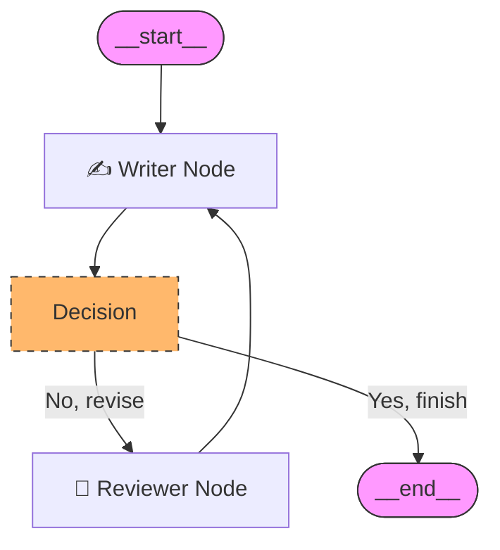

> [!EXAMPLE] Post Creation Agent
> Lets build a LinkedIn Post Generation LangGraph agent having two nodes a writer and a reviewer where one node writes a post and the other one keeps suggesting changes to it.

Thus the writer node has two options(i.e. it can either go to the reviewer node or can end) but the reviewer has only one option of going back to the writer.




### Coding the agent

```python
writer_prompt = ChatPromptTemplate.from_template(
    "Write a LinkedIn post about this topic: {topic}"
)

writer_chain = writer_prompt | model  

reviewer_prompt = ChatPromptTemplate.from_template(
    "Review the following LinkedIn post and suggest me improvements: {post}"
) 

reviewer_chain = reviewer_prompt | model
```

```python
graph = MessageGraph()  

def writer_node(state):
  topic = state[-1].content
  post = writer_chain.invoke({"topic":topic})
  return state+[AIMessage(content=post.content)]

  

def reviewer_node(state):
  post = state[-1].content
  review = reviewer_chain.invoke({"post":post})
  return state+[AIMessage(content=review.content)]  
  

graph.add_node("Writer",writer_node)
graph.add_node("Reviewer",reviewer_node)
graph.set_entry_point("Writer")
```

Establishing the Condition Check
```python
def condition_check(state):
  if len(state)>=5:
    return END

  else:
    return "Reviewer"
```

```python
graph.add_conditional_edges("Writer",condition_check)
graph.add_edge("Reviewer",END)
agent = graph.compile()
```

```python
response = agent.invoke([HumanMessage(content="I have won the Be10X Hackathon")])
response
```

