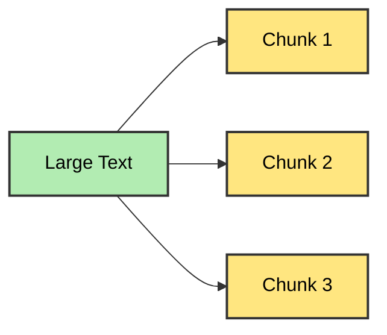

> [!INFO] Definition
> **Text Splitting** is the process of breaking **large chunks of text** (like **articles**, **PDFs**, **HTML pages**, or **books**) into smaller, manageable pieces (**chunks**) that an **LLM can handle effectively**.



```python
pip install langchain-text-splitters
```

### Character Text Splitter

```python
from langchain_text_splitters import CharacterTextSplitter
splitter = CharacterTextSplitter(chunk_size=10,chunk_overlap=5,separator="")
```

Splitting Text
```python
text = """ Lorem ipsum dolor sit amet, consectetur adipiscing elit. Sed euismod, nunc vel tincidunt facilisis, sapien justo fermentum nulla, vitae posuere magna erat sed purus. Integer nec risus ac nulla luctus tincidunt. Suspendisse potenti. Curabitur in felis nec lorem facilisis malesuada. Praesent sit amet sapien vitae justo viverra tincidunt. Etiam ac ligula vel lacus tincidunt dictum. Nullam ac sem nec justo varius tincidunt. Vestibulum ante ipsum primis in faucibus orci luctus et ultrices posuere cubilia curae; Sed ut perspiciatis unde omnis iste natus error sit voluptatem accusantium doloremque laudantium, totam rem aperiam. Eaque ipsa quae ab illo inventore veritatis et quasi architecto beatae vitae dicta sunt explicabo. Nemo enim ipsam voluptatem quia voluptas sit aspernatur aut odit aut fugit. Quis autem vel eum iure reprehenderit qui in ea voluptate velit esse quam nihil molestiae consequatur. Ut enim ad minima veniam, quis nostrum exercitationem ullam corporis suscipit laboriosam, nisi ut aliquid ex ea commodi consequatur"""
```

```python
res = splitter.split_text(text)
print(res)
# Output ['Lorem ips', 'm ipsum do', 'um dolor s', 'lor sit am', 'it amet, c', 'et, consec',....'nsequatur']
```

Splitting a document
```python
res_from_docs = splitter.split_documents('YOUR_PDF')
print(res_from_docs)
```

---
### RecursiveCharecterTextSplitter

```python
from langchain_text_splitters import RecursiveCharacterTextSplitter
recursive_splitter = RecursiveCharacterTextSplitter(chunk_size=10,chunk_overlap=5,separators=["\n\n","\n"," "])
```

```python
res_recursive = recursive_splitter.split_text(text)
print(res_recursive)
```

```python
print(len(res_recursive))
```
---
