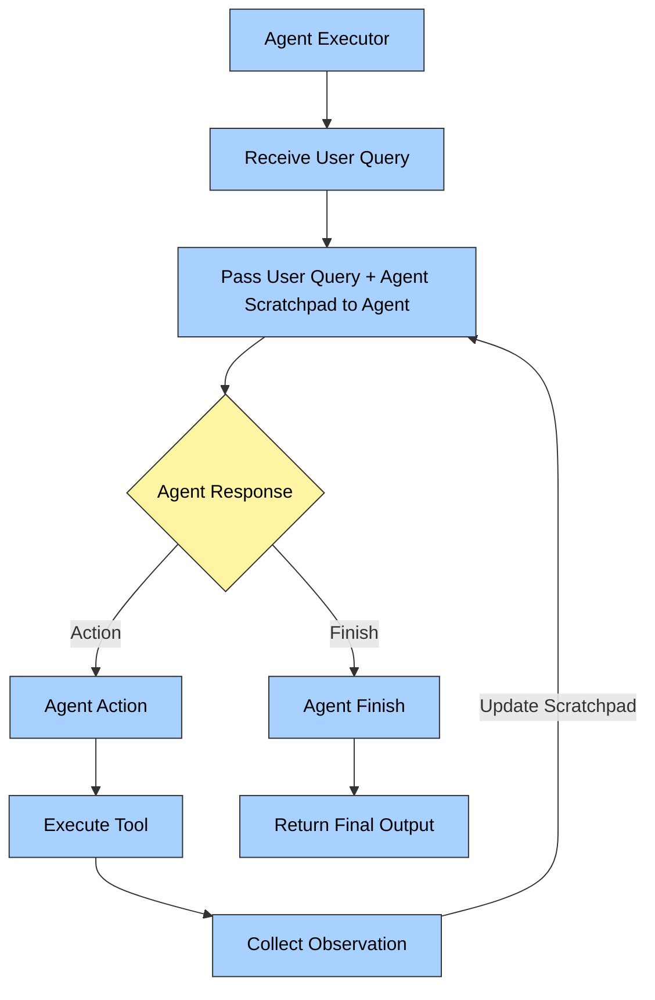

Agents in Langchain are built using the ReAct pattern.

> [!NOTE] What is ReAct?
> **ReAct** is a design pattern used in AI agents that stands for **Re**asoning + **Act**ing. 
>
> It allows a language model (LLM) to **interleave** internal reasoning (**Thought**) with external actions (like tool use) in a **structured**, **multi-step process**.

Instead of generating an answer in one go, the model thinks step by step, deciding what it needs to do next and optionally calling tools (APIs, calculators, web search, etc.) to help it.

### The ReAct Loop (Example Trace)
This process creates a loop of *Reasoning* $\rightarrow$ *Acting* $\rightarrow$ *Observing*.

> [!EXAMPLE] Trace: "Find the population of the capital of France"
> **Thought:** I need to find the capital of France.
> **Action:** `search_tool`
> **Action Input:** "capital of France"
> **Observation:** Paris
>
> **Thought:** Now I need the population of Paris.
> **Action:** `search_tool`
> **Action Input:** "population of Paris"
> **Observation:** 2.1 million
>
> **Thought:** I now know the final answer.
> **Final Answer:** Paris is the capital of France and has a population of ~2.1 million.

### Use Cases
ReAct is useful for:
* **Multi-step problems** where intermediate reasoning is required.
* **Tool-augmented tasks** (web search, database lookup, etc.) where external information is needed.

## Agent Executor Flowchart




### Building Langchain Agents using Search Tool

```bash
pip install langchain langchain-core langchain-community langchain-groq langchain-classic python-dotenv pydantic requests
```

Using Tavily Search Tool
```python
from langchain_community.tools import TavilySearchResults
search = TavilySearchResults(tavily_api_key=SEARCH_API_KEY)
tools = [search]
```

```python
from langchain_classic.agents import AgentExecutor
from langchain_classic.agents import create_react_agent
from langchain_core.prompts import PromptTemplate
```

ReAct standard Prompt template

```python
prompt = PromptTemplate.from_template("""  
You are a helpful AI agent that follows the ReAct pattern.  
  
You have access to the following tools:  
{tools}  
  
Use the following format:  
  
Question: the user question  
Thought: reason about what to do next  
Action: the tool to use (one of [{tool_names}])  
Action Input: the input to the tool  
Observation: the result of the tool  
Final Answer: the final answer to the user  
  
Begin!  
  
Question: {input}  
Thought: {agent_scratchpad}  
""")

```

Creating the agent
```python
agent = create_react_agent(tools=tools, llm=model,prompt=prompt)
```

```python
agent_executor = AgentExecutor(  
    agent=agent,  
    tools=tools,  
    verbose=True,  
    handle_parsing_errors=True  
)
```

Invoking the agent
```python
agent_executor.invoke({"input": "I want the list of all flight prices from AirIndiaExpress,Indigo and AirIndia from LKO to BLR tonight"})
```

## Making Custom Tool

```python
import datetime
from langchain.tools import tool
```

Creating a custom tool to get the current date.
```python
@tool
def get_current_date(text: str) -> str:
    """Returns today's date, use this tool if you have any questions regarding date"""
    return datetime.date.today()
```

```python
tools = [get_current_date]
```

```python
prompt_for_CustomTool = PromptTemplate.from_template("""

You are a helpful AI agent that follows the ReAct pattern.
You have access to the following tools:
{tools}

Use the following format:
Question: the user question
Thought: reason about what to do next
Action: the tool to use (one of [{tool_names}])
Action Input: the input to the tool
Observation: the result of the tool
Final Answer: the final answer to the user

Begin!
Question: {input}

Thought: {agent_scratchpad}

""")
```

```python
agent1 = create_react_agent(tools=[get_current_date], llm=model,prompt=prompt_for_CustomTool)
```

```python
agent_executor_with_customTool = AgentExecutor(
    agent=agent1,
    tools=tools,
    verbose=True,
    handle_parsing_errors=True  

)
```

Invoking the agent
```python
agent_executor_with_customTool.invoke({"input":"What is todays date"})
```

